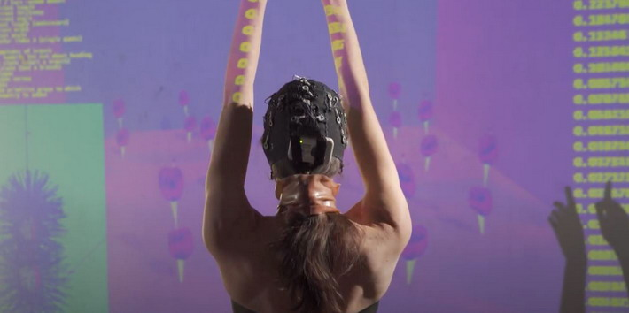

# REAFFERENCE
Collaborative platform for transdisciplinary EEG exploitation. 

The repository is a container of codes for REAFFERENCE project.

CONCEPT:
REAFFERENCE adds a new channel to the many sensory loops through which we interact with the world. It makes us aware of the hidden foundations of our conscious experience, by putting a visual scene under direct control of the complicated patterns of electrophysiological activity that constitute those same foundations. This is accomplished by on-line EEG analysis of scalp electric potentials, produced by the synchronous activity of large groups of neurons. Different features of this activity, like the relative power of alpha, beta and theta ratio, and spatial patterns of activations, are employed to control the features of the visual scene via concentration and relaxation. Thus the visual environment becomes an algorithmic visualization of the performer’s cerebral space, simulating the growth of organic bodies driven by the data registered during movement and rest. In an abstract digital space, the neuronal flora flourishes stimulated by behavior, movement and their reflection in the EEG trace, as an allegory of the ever interacting foundations of our cerebral activity. In fact, the more relaxed and focused is the performer, the faster and the more symmetric will be the visuals growth.

BIO:
REAFFERENCE is the brain child of an interdisciplinary team of artists and scientists with a common interest in embodiment, dance, neurofeedback, brain computer interface and interactive visualisation. We joined forces to develop  an accessible interactive EEG toolset compatible with the evergrowing scene of multimedia performances and dance, following open software and open hardware guidelines. We intend to make the experience of neurofeedback widely accessible to foster interactions between artists and neuroscientists.

REAFFERENCE team:

Developers:

Georgy Zarubin | Researcher, Max Planck Institute for Human Cognitive and Brain Sciences, Leipzig, Germany 

Mina Jamshidi Idaji | Researcher, Max Planck Institute for Human Cognitive and Brain Sciences, Leipzig, Germany 

Tilman Stephani | Researcher, Max Planck Institute for Human Cognitive and Brain Sciences, Leipzig, Germany 

Coordinator:

Alessandro Braga | Researcher, Max Planck Institute for Human Cognitive and Brain Sciences, Leipzig, Germany

Visual artist:

Ulysse Fontaine | Interactive media designer, Leipzig, Germany

Performer:

Sophie Mars | Dance Movement Therapist + Dance Artist , Berlin, Germany

Sound artist:

Spherical Aberration | AV producer and visual artist, Berlin, Germany

For questions and collaborations:
braga@cbs.mpg.de

STORY:

The starting focus of this project was a simple Python pipeline for extraction of attention / relaxation levels and motor imagery activity from EEG to use it in a BCI framework. This allows us to test the potential and limits of the available device and ways to modulate related visual and sound spaces using streaming of data via OSC protocol to TouchDesigner and Ableton applications. 

CURRENT STATE:

The first performance was made as a part of EDGE 2020 Exhibition, recorded on 6.11.20 in ZiMMT e.V. Leipzig and available in virtual exhibition space (https://edge-neuro.art/virtual-exhibition-2020/). The performace was recorded and edited by Nicola Piccini (nicolapiccini.com) and Valerio Figuccio (valeriofiguccio.com).

HARDWARE:

The system is based on mBrainTrain mobile EEG device.

LINKS:

Device page: https://mbraintrain.com/support/

Google doc for quick notes, general dumping, data acquisition pipeline: https://docs.google.com/document/d/1gqDmMJUV1vkObeEYlml45LO7qmUgNQ4syoi9aXsdOsI/edit?usp=sharing

Google drive for dataset sharing: https://drive.google.com/drive/folders/1cZ0uvtnLHsLnJOsBhiFi-ILcSbYPya7M?usp=sharing

Openvibe page: http://openvibe.inria.fr/downloads/

Pylsl: https://github.com/labstreaminglayer/liblsl-Python
